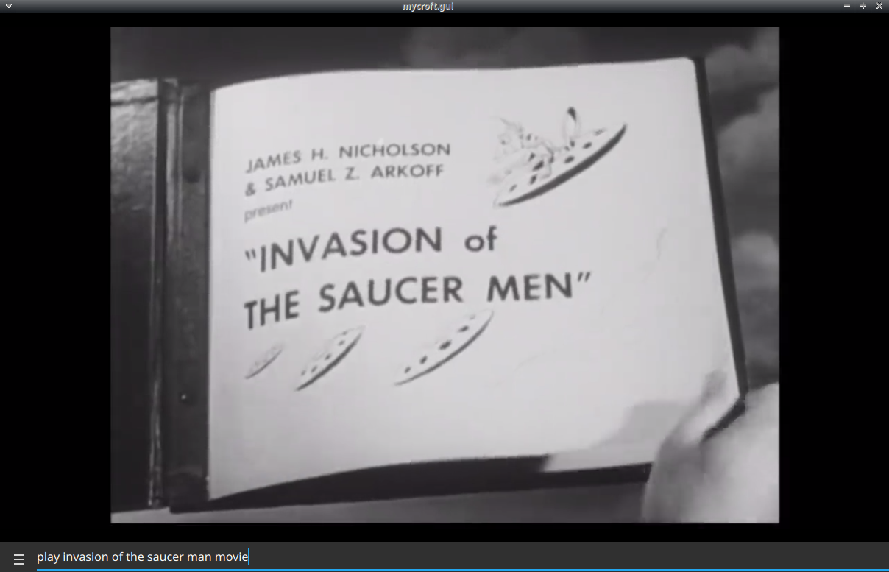

# Cult Cinema Classics Skill

## About 

Cult movie classics for Mycroft

## Installation Notes

this requires [skill-better-playback-control](https://github.com/JarbasSkills/skill-better-playback-control), it will blacklist and replace the official mycroft skill

## Examples 

* "open cult movie classics menu"
* "play zontar the thing from venus movie"
* "play cult movie classics"
* "play invasion of the saucer men"

## Credits 
- JarbasAl
- [AIIX ](https://github.com/AIIX/) - GUI
- [Cult Movie Classics](https://www.youtube.com/channel/UCycDFnpMeWzaITQSD1dWsOA)

## Category
**Entertainment**

## Tags
#movies
#publicdomain
#classicmovies
#video
#entertainment